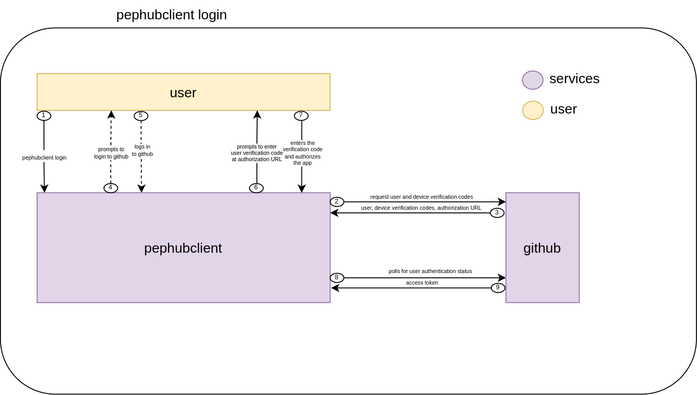
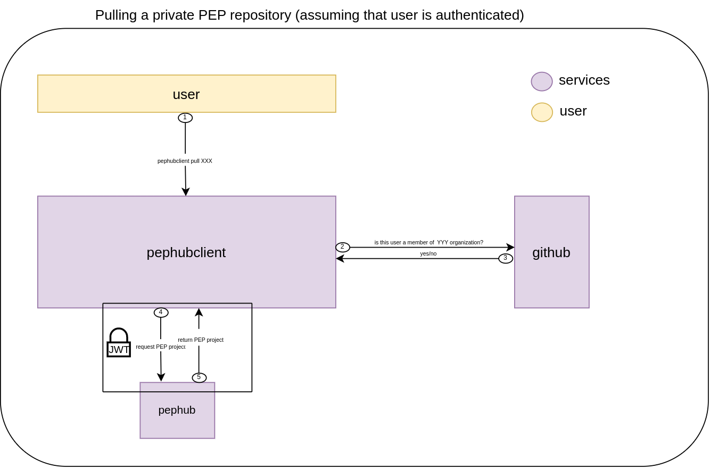

# `PEPHubClient`

`PEPHubClient` is a tool to provide Python and CLI interface for `pephub`.
Authorization is based on `OAuth` with using GitHub.

The authorization process is slightly complex and needs more explanation.
The explanation will be provided based on two commands:

## 1. `pephubclient login`
To authenticate itself user must execute `pephubclient login` command (1).
Command triggers the process of authenticating with GitHub.
`PEPHubClient` sends the request for user and device verification codes (2), and
GitHub responds with the data (3). Next, if user is not logged in, GitHub
asks for login (4), user logs in (5) and then GitHub asks to input 
verification code (6) that is shown to user in the CLI. 
After inputting the correct verification code (7), `PEPHubClient`
sends the request to GitHub and asks about access token (8), which is then
provided by GitHub based on data from authentication (9).

## 2. `pephubclient pull project/name:tag`

